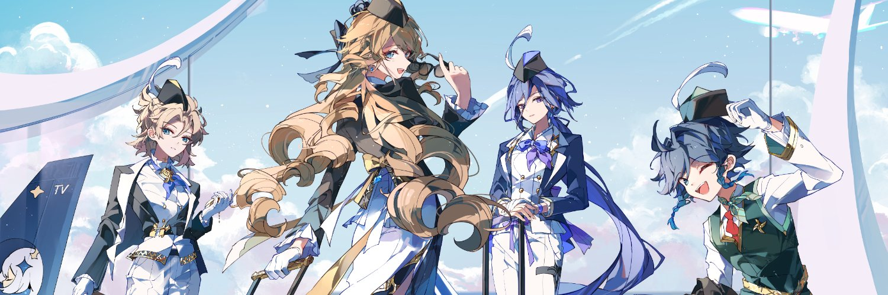

  

<h1 align="center">Doomsday Come</h1>

Jacob Kolinski — Phạm Bạch Đăng Khoa

> *Because of a lie. An end never existed. We long since strode into THEIR shadow, each step forward one that we can never walk back...until the last blade (Life) is forged into... "Naught".*

<i>Come to Me, Realm of the Dead. Come to Me, Flame of Self-Anihillation.</i>

  

## About

I am currently an Information Technology student at the [University of Science](https://hcmus.edu.vn/), [Vietnam National University Ho Chi Minh City](https://vnuhcm.edu.vn/en) (HCMUS-VNUHCM, 2025-2029), working toward specializing in Computer Science with a focus on Artificial Intelligence following my general foundational years.

  
<b>Achievements</b>

   

  - **15/07/2007**: Born
  - **02/03/2022**: 🥈 **`2nd Prize`** - *Province Youth and Children Creativity Contest*
  - **29/05/2022**: Graduated Secondary School
  - **21/01/2024**: 🥇 **`1st Prize`** - *City Science and Engineering Fair*
  - **28/02/2025**: 🥉 **`3rd Prize`** - *City Excellent Students in Information Technology Competition*
  - **01/06/2025**:  Graduated High School
  - **15/08/2025**:  Enrolled at University of Science via **`Priority Admission`** - **`Score: 29.37`**

Beyond my studies, I build and program things simply because I love coding from the bottom of my heart, and I am deeply in love with configuring and tweaking my Linux machine. When I step away from the terminal, I spend most of my time listening to music, doing calculus and gaming. Mostly grinding anime Gacha games, chess.com, playing Counter-Strike 2, or pushing through levels in Geometry Dash.

  
<b>Workspaces</b>

   
  

    
    
    
    
     
    
    
    
  

## Skills

  

## Contributions

## Contacts

## Projects
